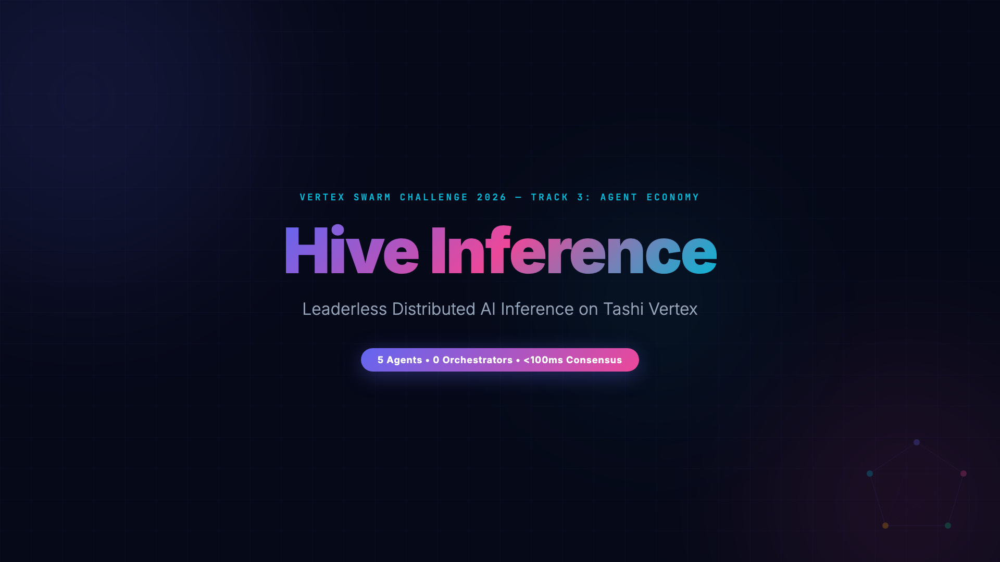
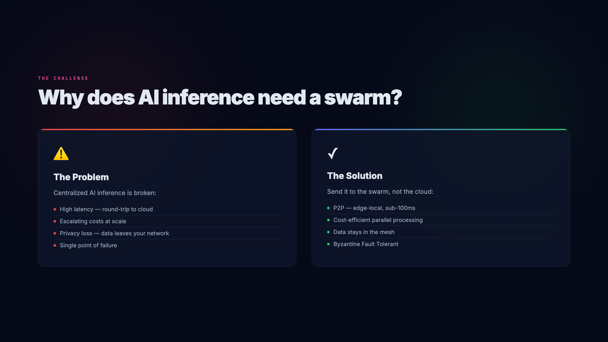
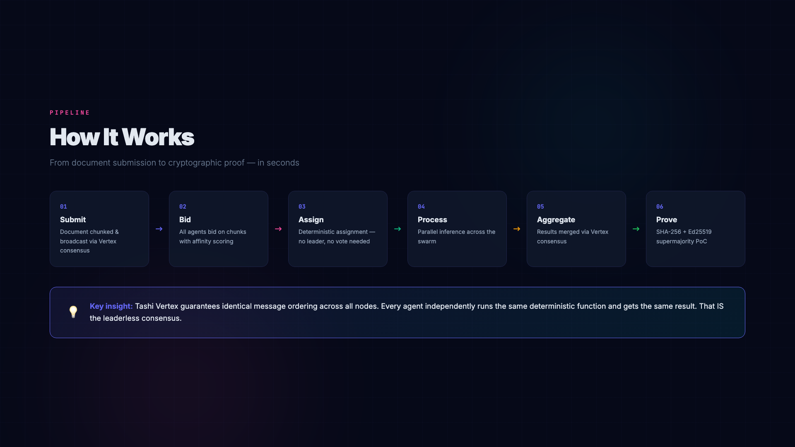
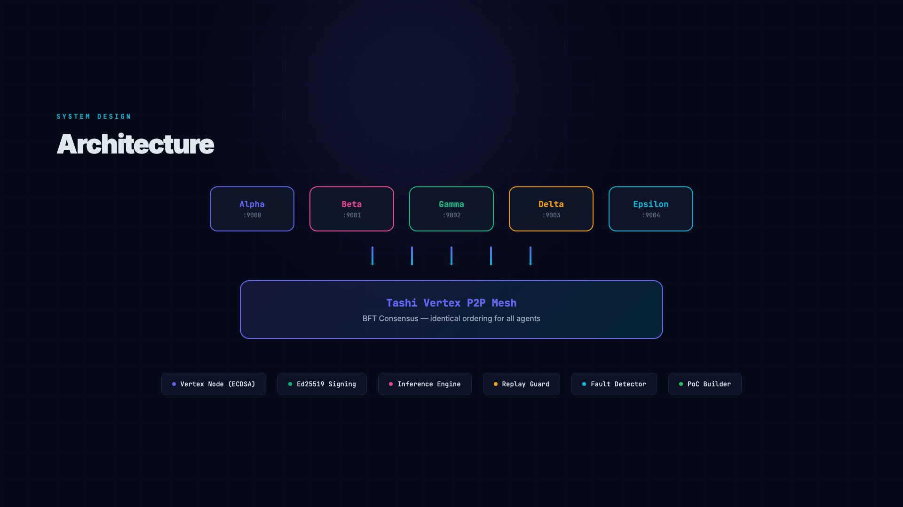
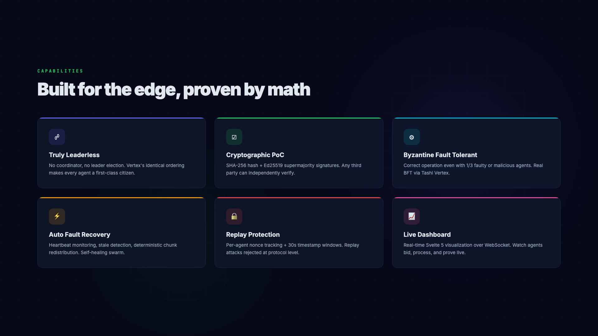
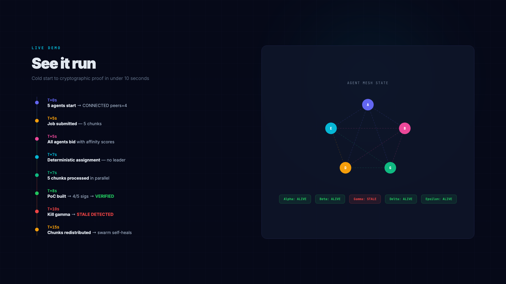
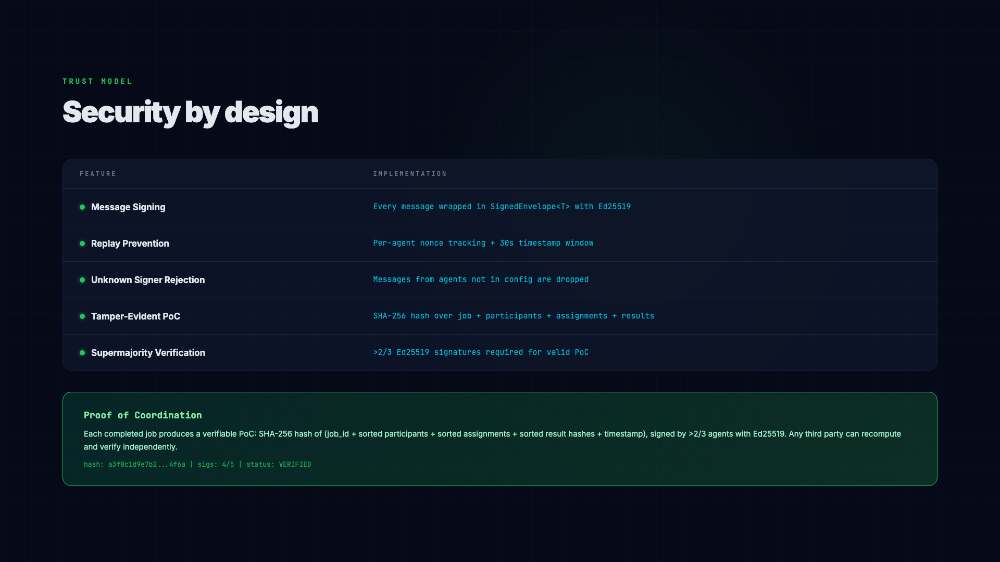

# Hive Inference

**Leaderless Distributed AI Inference on Tashi Vertex**

> Vertex Swarm Challenge 2026 — Track 3: Agent Economy

[](https://borahanmirzaii.github.io/hive-inference/)
[](https://www.rust-lang.org/)
[](https://docs.tashi.network/)



## What is this?

Hive Inference is a P2P system where 5 AI agents coordinate to split, process, and aggregate inference tasks — with zero central orchestrator, zero cloud dependency, and cryptographic Proof of Coordination.

**The problem:** Today, AI inference goes to a central server. This means latency, cost, privacy loss, single point of failure.

**The solution:** Send your document to the swarm, not the cloud. The swarm decides who processes what, does the work, aggregates the result, and proves it — all P2P, all in milliseconds.



## How it works



```
User submits document
    → Vertex consensus broadcasts to all agents
    → Every agent bids on chunks (with affinity-based scoring)
    → Identical message ordering = identical assignment (no leader needed)
    → Chunks processed in parallel
    → Results aggregated via Vertex consensus
    → Cryptographic Proof of Coordination emitted (SHA-256 + Ed25519 supermajority)
```

**Key insight:** Tashi Vertex guarantees identical message ordering across all nodes. Every agent independently runs the same deterministic assignment function and gets the same result. That IS the leaderless consensus.

## Architecture



```
┌─────────────────────────────────────────────────────┐
│                Hive Inference Swarm                  │
│                                                      │
│  ┌────────┐  ┌────────┐  ┌────────┐  ┌────────┐  ┌────────┐
│  │ Alpha  │  │  Beta  │  │ Gamma  │  │ Delta  │  │Epsilon │
│  │ :9000  │  │ :9001  │  │ :9002  │  │ :9003  │  │ :9004  │
│  └───┬────┘  └───┬────┘  └───┬────┘  └───┬────┘  └───┬────┘
│      │           │           │           │           │
│  ┌───┴───────────┴───────────┴───────────┴───────────┴───┐
│  │              Tashi Vertex P2P Mesh                     │
│  │     BFT Consensus — same ordering for all agents       │
│  └───────────────────────────────────────────────────────┘
│                                                      │
│  Each agent runs:                                    │
│  • Vertex node (ECDSA P2P)     • Ed25519 signing     │
│  • Mock inference engine       • Replay guard         │
│  • Fault detector              • PoC builder          │
└─────────────────────────────────────────────────────┘
```

## Features



| Feature | Description |
|---|---|
| **Truly Leaderless** | No coordinator, no leader election — Vertex's identical ordering makes every agent a first-class citizen |
| **Cryptographic PoC** | SHA-256 hash + Ed25519 supermajority signatures, verifiable by any third party |
| **Byzantine Fault Tolerant** | Correct operation even with 1/3 faulty or malicious agents |
| **Auto Fault Recovery** | Heartbeat monitoring, stale detection, deterministic chunk redistribution |
| **Replay Protection** | Per-agent nonce tracking + 30s timestamp windows |
| **Live Dashboard** | Real-time Svelte 5 visualization over WebSocket |

## Tech Stack

| Component | Technology |
|---|---|
| Consensus | `tashi-vertex` 0.13.0 (real BFT, not simulated) |
| App signing | Ed25519 via `ed25519-dalek` |
| PoC hashing | SHA-256 via `sha2` |
| Runtime | Rust + Tokio async |
| Dashboard | Svelte 5 + Vite (WebSocket) |

## Demo



```
T+0s   5 agents start → CONNECTED peers=4
T+5s   Job "analyze this document" (5 chunks)
T+5s   All agents bid with affinity-based scores
T+7s   Deterministic assignment — no leader, no vote
T+7s   5 chunks processed in parallel
T+8s   Results aggregated via Vertex
T+8s   PoC built + 4/5 signatures → VERIFIED
T+10s  Kill agent-gamma → STALE DETECTED
T+15s  Chunks redistributed → recovery complete
```

## Security



| Feature | Implementation |
|---|---|
| Message signing | Every message wrapped in `SignedEnvelope<T>` with Ed25519 |
| Replay prevention | Per-agent nonce tracking + 30s timestamp window |
| Unknown signer rejection | Messages from agents not in config are dropped |
| Tamper-evident PoC | SHA-256 hash over job + participants + assignments + results |
| Supermajority verification | >2/3 Ed25519 signatures required for valid PoC |

## Proof of Coordination

Each completed job produces a PoC containing:
- SHA-256 hash of: `job_id + sorted(participants) + sorted(assignments) + sorted(result_hashes) + timestamp`
- Ed25519 signatures from >2/3 of participants over that hash
- Written to `poc_log.jsonl` as immutable audit trail

Verification: any third party can recompute the hash and verify all signatures independently.

## Quick Start

### Prerequisites

- Rust 1.75+ with Cargo
- CMake >= 4.0
- tmux
- pnpm (for dashboard)

### Run

```bash
# 1. Generate 5 agent keypairs
bash scripts/gen_keys.sh

# 2. Launch the swarm (5 agents in tmux)
bash scripts/run_swarm.sh

# 3. Open dashboard (optional)
cd dashboard && pnpm dev

# 4. Run demo scenario
bash scripts/demo.sh

# 5. Watch live
tmux attach -t hive-swarm
```

## Project Structure

```
├── crates/
│   ├── hive-core/src/          # Core library
│   │   ├── types.rs            # All message types + SignedEnvelope<T>
│   │   ├── identity.rs         # Ed25519 sign/verify
│   │   ├── network.rs          # Multi-peer Vertex wrapper
│   │   ├── coordinator.rs      # Deterministic chunk assignment
│   │   ├── inference.rs        # Mock text analysis
│   │   ├── proof.rs            # PoC builder + verifier
│   │   ├── replay_guard.rs     # Nonce + timestamp anti-replay
│   │   └── recovery.rs         # Fault detection + redistribution
│   └── hive-node/src/          # CLI binary
│       ├── main.rs             # Agent event loop
│       └── ws_server.rs        # WebSocket dashboard server
├── dashboard/                  # Svelte 5 live visualization
├── config/                     # Generated swarm config
└── scripts/                    # gen_keys, run_swarm, demo
```

## License

MIT
